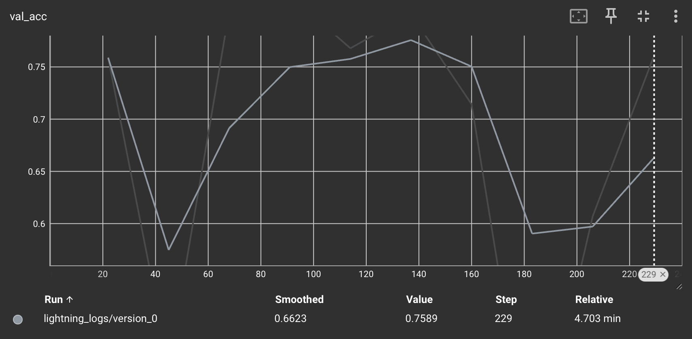

# Image Classification

This repository contains an implementation of an image classification model to distinguish between cats and dogs using PyTorch and PyTorch Lightning. The project demonstrates a complete end-to-end workflow—from data preprocessing and model development from scratch without pre-trained models to training, evaluation, and inference.

## Table of Contents

- [Project Overview](#project-overview)
- [Project Setup](#project-setup)
  - [Clone the Repository](#1-clone-the-repository)
  - [Create a Virtual Environment](#2-create-a-virtual-environment)
  - [Activate the Virtual Environment](#3-activate-the-virtual-environment)
  - [Install Dependencies](#4-install-dependencies)
  - [Prepare the Dataset](#5-prepare-the-dataset)
  - [Directory Structure](#6-directory-structure)
- [Usage](#usage)
  - [Training the Model](#training-the-model)
  - [Evaluating the Model](#evaluating-the-model)
  - [Making Predictions](#making-predictions)
- [Logging and Evaluation](#logging-and-evaluation)
  - [TensorBoard Visualization](#tensorboard-visualization)
- [Model and Training Details](#model-and-training-details)
- [Evaluation Metrics](#evaluation-metrics)
  - [Training Loss Curve](#training-loss-curve)
  - [Validation Loss Curve](#validation-loss-curve)
  - [Validation Accuracy Curve](#validation-accuracy-curve)
  - [Epoch Curve](#epoch-curve)
  - [Prediction Results](#prediction-results)
- [Challenges and Future Work](#challenges-and-future-work)
  - [Challenges](#challenges)
  - [Future Work](#future-work)
- [Final Thoughts](#final-thoughts)

---

## Project Overview

This project implements a modified ResNet model for binary classification of images into two categories: **cats and dogs**. The key aspects include:

- **Data Preprocessing:**  
  Images are resized to **64x64 pixels**, converted to **grayscale**, and optionally augmented (**random horizontal flip**) during training, we can also add more augmentations if we want.

- **Model Architecture:**  
  A modified **ResNet18** is tailored to accept grayscale images and output **two classes**. **Adaptive average pooling** ensures compatibility with different input sizes.

- **Training & Evaluation:**  
  The model is trained using **PyTorch Lightning**, which simplifies the training loop, logging, and checkpointing. Metrics are logged via **TensorBoard**, and the best model is saved automatically.

- **Testing & Inference:**  
  Separate scripts allow evaluation on a test set and making predictions on new images.

---

## Project Setup

### 1️. Clone the Repository
```bash
git clone <https://github.com/shubhvashishth/Image-Classification>
cd <repository_directory>
```

### 2. Create a Virtual Environment
```bash
python -m venv env
```

### 3. Activate the Virtual Environment

- On Linux/macOS:
```bash
source venv/bin/activate
```
- On Windows:
```bash
venv\Scripts\activate
```

### 4.  Install Dependencies
```bash
pip install -r requirements.txt
```
**Note : Notcied some errors while running on windows so,if running on windows downgrade numpy package to numpy==1.24.3, also do pip install tensorboard.**

### 5.  Prepare the Dataset
- Download the dataset from the provided source.
- Copy the dataset folder inside the main project directory.
- Rename the dataset folder to data.
- Delete the horse folders inside the train,test,val .

### 6.  Directory Structure

<br>
**The directory should look something like this.**
---

## Usage
 **1. Training the Model**
 <br>
 - To start training, run:
    ```bash
    python src/train.py
    ```

- Loads the dataset and applies preprocessing.
- Trains the modified ResNet model.
- Logs metrics to TensorBoard.
- Saves the best model checkpoint inside the checkpoints/ folder.

**2. Evaluating the Model**
<br>
- To evaluate the model, run:
    ```bash
    python src/test.py --test_data data --checkpoint path_to_ckpt
    ```
- Keep the dataset path as data it will pick the test folder itself.
- The script loads the best model from the specified checkpoint.
- Evaluates the model on the test set.
- Prints the test accuracy.

**3. Making Predictions**
<br>
- To make predictions, run:
    ```bash
    python src/predict.py --image_path sample.jpg --checkpoint_path path_to_ckpt
    ```
- The script preprocesses the input image.
- Outputs the predicted class (Cat/Dog) and the confidence score.


## Logging and Evaluation 

**TensorBoard Visualization**
```bash
tensorboard --logdir=logs
```

- Then, open the provided URL in your browser to visualize:
- Loss curves (training vs. validation)
- Validation accuracy


## Training Details

- Loss Function:
Uses CrossEntropyLoss, which is well-suited for classification tasks.
- Optimizer:
Adam optimizer with a learning rate of 1e-3 is chosen for its efficiency and ability to converge faster.
- Metrics:
Accuracy is computed for both validation and test sets using torchmetrics to monitor performance.

**Why These Choices?**
- ResNet18 provides a good balance between performance and computational efficiency.
- Adam optimizer and CrossEntropyLoss are standard choices that have proven effective in numerous image classification tasks.

## Evaluation Metrics


**Analysis :**
The training loss starts at 0.686 and gradually decreases to 0.683 over steps 80–180, indicating a slow but steady learning process. However, the final reported value at step 199 is 0.7122, which is higher than earlier values. This suggests potential noise in the training phase, possibly due to:

- Fluctuations in learning rate.
- Mini-batch variability.
- Maybe overfitting to specific batches followed by a spike in loss.


**Analysis :**
Validation loss decreases from 0.75 to 0.4783 by step 229, demonstrating effective generalization. The smoothed loss (0.5992) aligns with this downward trend, suggesting consistent improvement. This contrasts with the training loss’s final spike, implying the model avoids severe overfitting despite training instability.



**Analysis :**
Validation accuracy shows initial values of 0.75, 0.7, 0.65, and 0.6 at intermediate steps, but the final accuracy at step 229 is 0.7589. This indicates:

- Early fluctuations, possibly due to model adaptation.
- Recovery and improvement in generalization toward the end of training.
- A peak performance of ~75.9%, which is promising but leaves room for optimization.

The smoothed accuracy (0.6623) is lower than the final value, highlighting variability during training. Regularization techniques (e.g., dropout, weight decay) could help stabilize performance.


### Prediction Results 

To test our model’s performance, we downloaded a random sample image from the internet and passed it through the trained model. The model processed the image and predicted the class along with a confidence score.


<p align="center">  </p>
<p align="center">  </p>

## Challenges and Future Work
**Challanges**
- The original ResNet18 is designed for RGB images (3 channels), but our preprocessing converts to grayscale images (1 channel).
- Using the default model would result in a shape mismatch error.
- During evaluation, it was observed that our model consistently favors one class. In our binary classification setup (cats vs. dogs), nearly every image is classified as the same class regardless of the actual content.

  - **Data Imbalance:**  
  The training dataset may contain an unequal number of samples for each class, leading the model to favor the majority class.
  
  - **Training Issues:**  
  Insufficient training or suboptimal convergence can cause the model to settle into a local minimum where it predicts only one class.
  
  - **Architectural or Hyperparameter Limitations:**  
  The current model architecture or chosen hyperparameters might not be robust enough to capture the subtle differences between classes.


**Future Work**

- Data Augmentation Expansion
- Learning Rate Scheduling : We could also use `ReduceLROnPlateau` .

- **Dataset Rebalancing:**  
  Ensure that the dataset is balanced. If necessary, augment the data for the underrepresented class to achieve a more equitable distribution.

- **Class Weighting:**  
  Incorporate class weights in the loss function (e.g., using `torch.nn.CrossEntropyLoss(weight=...)`) to penalize misclassification of the minority class.

- **Enhanced Data Augmentation:**  
  Implement more robust augmentation strategies during training to help the model learn invariant features across both classes.

- **Hyperparameter Tuning:**  
  Experiment with different learning rates, batch sizes, and regularization techniques to improve the model's convergence and reduce bias.

- **Model Architecture Improvements:**  
  Explore alternative or deeper architectures that may better capture the nuanced differences between the two classes.


## Final Thoughts 

Overall, the project was not too difficult but required careful attention to detail—especially in modifying ResNet, handling data transformations, and structuring the training pipeline properly.
